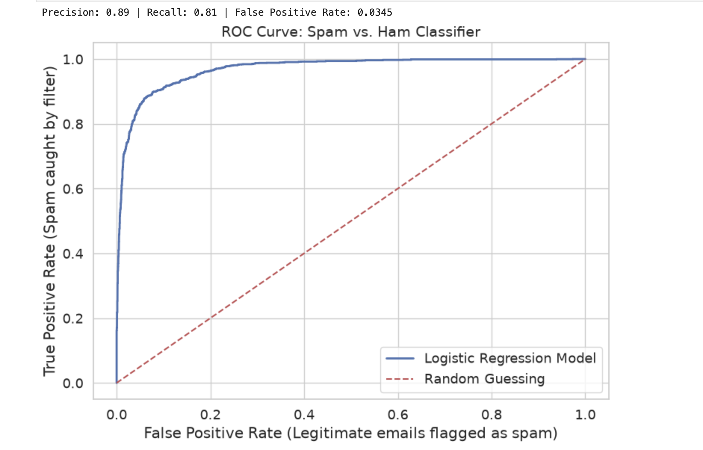

# Spam Email Classification & Content Moderation Audit

This repository contains the methodology and findings for a predictive Natural Language Processing (NLP) model designed to classify emails as spam or ham (legitimate). 

**Objective**
Build a scalable Logistic Regression classifier and analyze the critical business trade-offs between precision and recall in digital content moderation.

**Technical Stack**
*   **Libraries:** Python, scikit-learn, NumPy, pandas, Matplotlib, Seaborn.
*   **Methodology:** Logistic Regression (L-BFGS solver), 10-fold cross-validation, regex vectorization, Receiver Operating Characteristic (ROC) analysis.

**Feature Engineering & Pipeline**
The model utilizes a custom data processing pipeline to evaluate both the vocabulary and the structural metadata of a message:
*   **Text & HTML Parsing:** Processed raw strings to detect a curated list of high-signal spam indicators. Surprisingly, the presence of HTML formatting tags (``, `<td>`, `<tr>`) proved to be highly predictive, separating automated marketing blasts from plain-text conversational emails.
*   **Heuristic Metadata Extraction:** Engineered quantitative features including log-transformed email length, punctuation density (exclamation points and currency symbols), and response indicators (e.g., "Re:" in the subject line).

**Moderation Trade-offs & Interpretability**
In the context of entertainment and social media platforms, content moderation requires navigating ambiguous "ground truths." A model that aggressively flags spam might inadvertently censor legitimate communication (False Positive), while a lenient model degrades the user experience by allowing unsolicited content (False Negative).

By maintaining a highly interpretable Logistic Regression model rather than utilizing a "black-box" neural network, specific moderation decisions remain transparent. If a legitimate message is incorrectly flagged, the model's weights allow policy teams to pinpoint the exact feature (e.g., a specific flagged keyword) responsible for the error and adjust the decision threshold accordingly.

**ROC Curve Analysis**
The Receiver Operating Characteristic (ROC) curve below illustrates the model's ability to trade off the False Positive Rate against the True Positive Rate, achieving a high degree of separation between classes well above the random-guessing baseline.

*Note: The raw algorithmic pipeline and dataset are maintained in a separate, private repository to comply with academic integrity policies. Codebase access is available upon request.*
